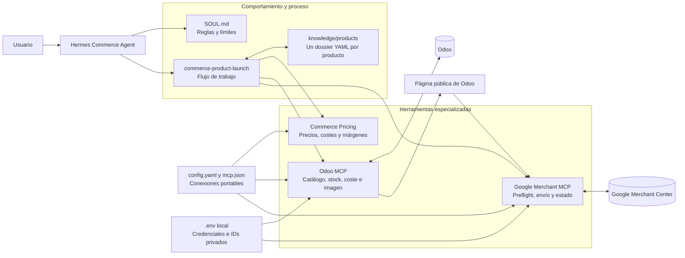

# 1. Arquitectura del agente

## Diagrama



Fuente Mermaid: [`diagrams/arquitectura.mmd`](diagrams/arquitectura.mmd).

## Qué hace cada parte

### Usuario

Habla en términos comerciales. No necesita conocer el identificador interno de
una fuente de Google ni la estructura técnica de Odoo. Puede decir, por ejemplo:

```text
Quiero vender este producto. Tengo un coste de 640 €, veinte unidades y este
proveedor. Investiga el mercado y prepáralo para publicarlo.
```

### Hermes Commerce Agent

Interpreta la petición, determina el estado actual del proceso y decide qué
información o herramienta necesita. Coordina las piezas, pero no sustituye a
Odoo ni a Google Merchant.

### `SOUL.md`

Define las reglas permanentes del agente: no inventar costes, stock, GTIN,
proveedores, especificaciones ni derechos de imagen; distinguir hechos de
estimaciones; y pedir aprobación antes de acciones comerciales sensibles.

### Skill `commerce-product-launch`

Es el procedimiento operativo. Indica el orden de las fases, qué validaciones
deben ejecutarse y dónde se encuentran las tres puertas de aprobación.

### Dossiers YAML

Cada producto identificado tiene un archivo en `knowledge/products/`. Este
archivo conserva identidad, fuentes, investigación, estimaciones y decisiones.
Si el producto vuelve a aparecer en otra conversación, se actualiza el mismo
dossier en lugar de empezar desde cero.

El YAML no sustituye a Odoo para valores que cambian continuamente. El stock y
el precio publicado se vuelven a consultar en Odoo cuando se necesitan.

### MCP de pricing

Realiza cálculos deterministas: suelo de precio, impuestos, costes, beneficio,
margen y escenarios conservador, moderado y agresivo. No publica productos.

### MCP de Odoo

Es la interfaz con el catálogo operativo. Lee productos, variantes, stock,
proveedores, coste, impuestos y página pública. Las escrituras sensibles están
protegidas mediante confirmaciones explícitas.

### MCP de Google Merchant

Descubre cuentas y fuentes de datos, valida el producto contra la página pública,
lo envía solamente después de la autorización y consulta después su estado e
incidencias.

### Configuración y secretos

`config.yaml`, `mcp.json` y `distribution.yaml` hacen que el agente sea
instalable en distintos equipos. Los dominios, IDs de cuenta y credenciales
pertenecen al `.env` local de cada instalación y nunca a los dossiers o al
repositorio.
