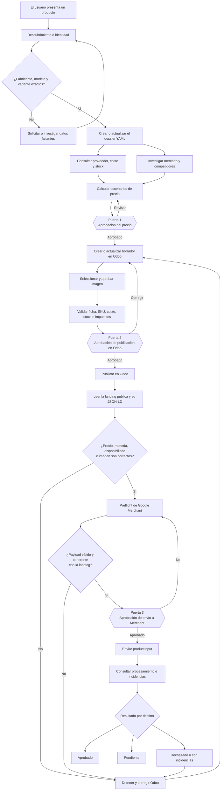

# 2. Ciclo de vida de un producto

## Diagrama

Fuente Mermaid: [`diagrams/ciclo-producto.mmd`](diagrams/ciclo-producto.mmd).

## Explicación por fases

### 1. Descubrimiento e identidad

Una petición genérica como «publica una RTX» no es suficiente. Hermes debe
conocer fabricante, modelo, variante y un SKU o MPN estable. El GTIN es opcional,
pero nunca se inventa.

### 2. Expediente del producto

Cuando la identidad es suficientemente precisa se crea un YAML desde
`knowledge/products/_template.yaml`. Si el slug ya existe, se actualiza. Por
eso `rtx-pro-6000-server.yaml` se conserva: es un expediente útil, no código de
usar y tirar.

Los valores se etiquetan como verificados, aportados por el usuario, estimados o
desconocidos. También se guardan las fuentes y fechas.

### 3. Proveedor, coste y mercado

Hermes consulta primero Odoo. Puede descubrir proveedores por nombre y leer el
coste configurado. Si faltan datos, pregunta al usuario o deja el valor como
desconocido. Al mismo tiempo recopila comparables de mercado de la variante
exacta.

### 4. Propuesta y Puerta 1

El motor de pricing combina coste, logística, otros costes, comisiones,
impuestos y mercado. Devuelve suelo de precio y tres escenarios. Antes de crear
o modificar el borrador comercial, Hermes muestra los cálculos y espera la
aprobación del usuario.

### 5. Borrador e imagen

Con el precio aprobado se prepara Odoo. La imagen puede proceder del usuario o
de una fuente web aprobada. Hermes comprueba la variante y no utiliza una
miniatura de buscador como imagen definitiva.

### 6. Validación y Puerta 2

Hermes vuelve a leer el producto completo. Comprueba SKU, coste, proveedor,
stock, impuestos, URL e imagen. Presenta una previsualización y solo publica con
la confirmación `PUBLICAR_EN_ODOO`.

### 7. La landing como realidad pública

Después de publicar, se lee la página que verá el comprador. El precio, la
moneda y la disponibilidad de esa página son los valores que deben enviarse a
Google. Una discrepancia detiene el proceso.

### 8. Preflight y Puerta 3

El preflight de Merchant valida campos, URL, imagen y coherencia con la landing,
pero no publica. Si el resultado es `ready=true`, Hermes enseña el payload final
y espera otra aprobación independiente.

Solo entonces utiliza `PUBLICAR_EN_GOOGLE_MERCHANT`.

### 9. Revisión posterior

Una petición aceptada por la API todavía puede estar pendiente o ser rechazada.
Hermes consulta el producto procesado y sus incidencias y comunica el resultado
por destino.
