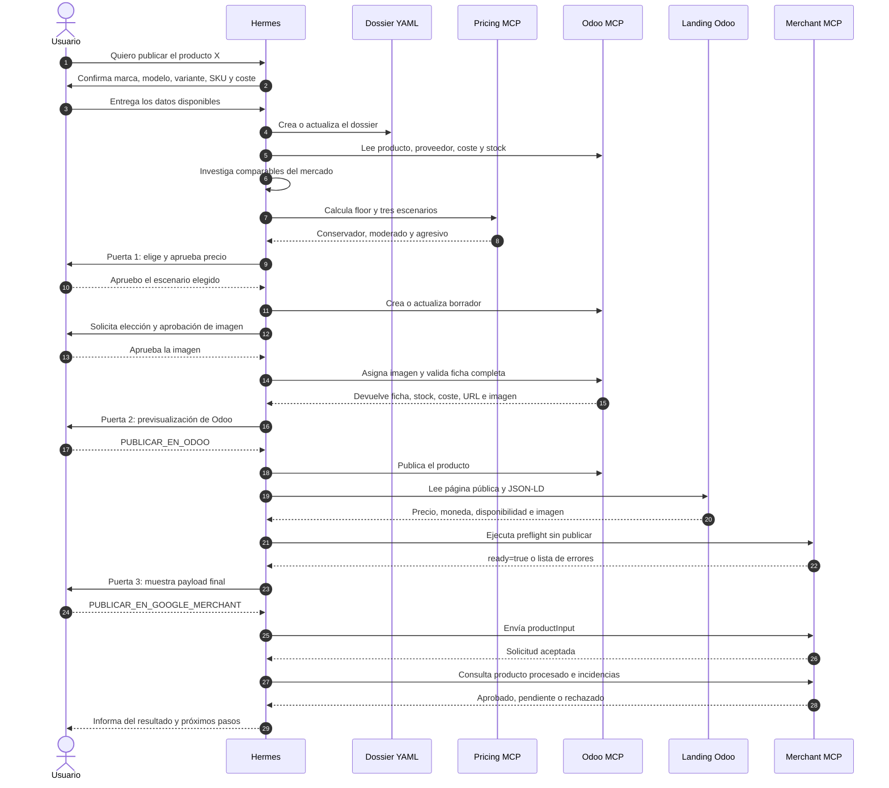

# 3. Ejemplo de publicación de un producto nuevo

Este ejemplo es ilustrativo. Los nombres y valores deben reemplazarse por los
datos verificados del producto real.

## Diagrama de conversación



Fuente Mermaid: [`diagrams/ejemplo-publicacion.mmd`](diagrams/ejemplo-publicacion.mmd).

## Conversación posible

### Petición inicial

```text
Usuario:
Quiero publicar un nuevo servidor RTX PRO 6000. El proveedor me ofrece una
unidad por 15.700 € sin IVA.
```

Hermes todavía no publica nada. Primero puede responder:

```text
Necesito confirmar fabricante, modelo completo, configuración exacta, SKU o
MPN, stock disponible y si existe un GTIN verificable. También necesito saber
si el transporte y las comisiones están incluidos en esos 15.700 €.
```

### Creación del dossier

Con la identidad confirmada, Hermes crea un nombre estable, por ejemplo:

```text
knowledge/products/fabricante-modelo-mpn.yaml
```

El archivo contiene tanto lo conocido como lo pendiente. Un dato aportado por
el usuario no se presenta como si estuviera verificado por una fuente externa.

### Precio

Hermes consulta Odoo y el mercado, y después presenta algo parecido a:

```text
Coste de compra:        15.700 €
Transporte:             desconocido
Otros costes:           desconocidos
IVA:                    21 %
Costes completos:       no
Suelo calculado:        provisional

Escenario A: conservador
Escenario B: equilibrado
Escenario C: mayor margen
```

Como comprobación básica, `15.700 × 1,21 = 18.997 €`. Este importe todavía no
es necesariamente el precio recomendado porque podrían faltar transporte,
comisiones y margen.

Hermes se detiene y pide al usuario elegir o modificar un escenario. La
aprobación de precio no autoriza todavía ninguna publicación.

### Preparación en Odoo

Después de la Puerta 1, Hermes prepara el borrador y muestra antes de publicar:

```text
Nombre comercial
SKU o MPN estable
Precio aprobado
Stock verificado
Proveedor y coste
Impuestos observados
Imagen seleccionada
URL pública prevista
Campos desconocidos o no disponibles
```

Para publicar, el usuario debe confirmar expresamente:

```text
PUBLICAR_EN_ODOO
```

### Verificación pública

Hermes abre la landing publicada. Si el precio, moneda, disponibilidad o imagen
no coinciden con lo aprobado, se detiene y vuelve a Odoo. No compensa una
discrepancia modificando silenciosamente el payload de Google.

### Google Merchant

El preflight utiliza el mismo SKU/MPN como `offerId`, la URL final, la imagen
pública y el precio realmente observado. Muestra el payload y los resultados de
las comprobaciones.

El usuario debe dar una tercera autorización:

```text
PUBLICAR_EN_GOOGLE_MERCHANT
```

Finalmente, Hermes consulta si el producto está aprobado, pendiente o contiene
incidencias. «Enviado correctamente» no se presenta como sinónimo de
«aprobado por Google».

## Qué ocurre si falta algo

- Identidad ambigua: Hermes pregunta y no crea una ficha definitiva.
- Coste desconocido: no inventa un coste ni recomienda publicación desatendida.
- Precio no aprobado: no prepara el borrador comercial.
- Imagen dudosa: solicita otra imagen o aprobación de una fuente válida.
- Landing incorrecta: no continúa hacia Merchant.
- Preflight con errores: no llama al endpoint de publicación.
- Incidencias de Merchant: las informa y propone volver al punto que debe
  corregirse.
