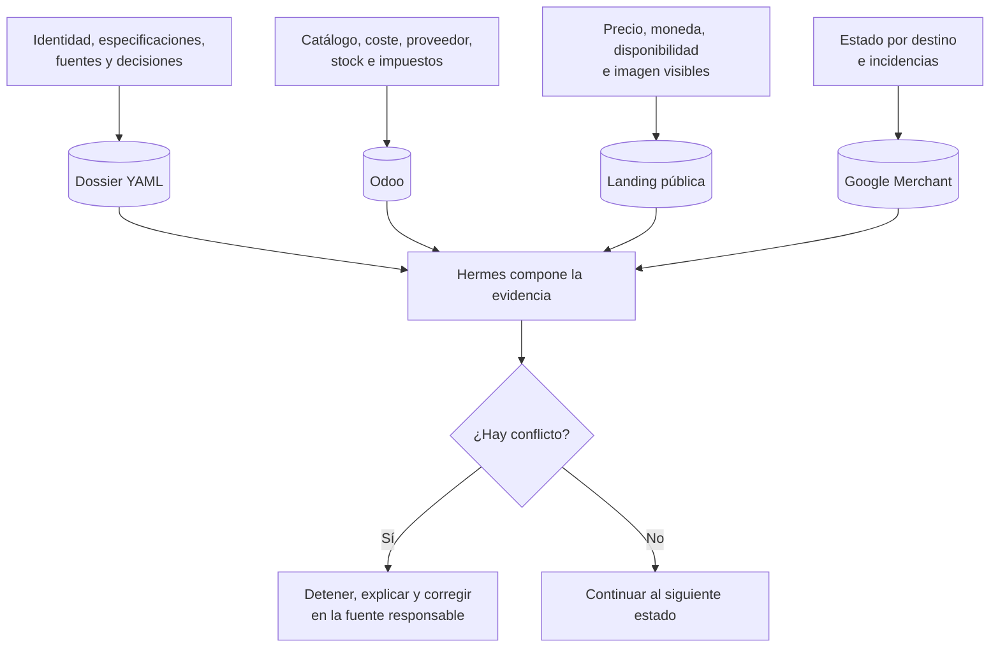

# 4. Fuentes de verdad y seguridad

## Diagrama

Fuente Mermaid: [`diagrams/fuentes-de-verdad.mmd`](diagrams/fuentes-de-verdad.mmd).

## Propietario de cada dato

| Información | Fuente de verdad | Motivo |
| --- | --- | --- |
| Identidad y especificaciones verificadas | Dossier YAML con fuentes | Conserva evidencia e historia |
| SKU operativo | Odoo, enlazado en el dossier | Identidad estable entre canales |
| Coste y proveedor configurados | Odoo | Son datos comerciales operativos |
| Stock actual | Odoo | Cambia con movimientos de inventario |
| Precio interno | Odoo | Es el precio configurado en la tienda |
| Precio que debe ver Google | Landing pública | Es lo que observa el cliente y Google |
| Estado e incidencias del canal | Google Merchant | Es el resultado procesado por Google |
| Credenciales e IDs privados | `.env` local | No deben viajar con el repositorio |

## Las tres puertas principales

### Puerta 1: precio

Impide que una estimación o un cálculo incompleto se conviertan automáticamente
en una decisión comercial. La persona elige el escenario y aprueba el importe.

### Puerta 2: Odoo

Impide que preparar una ficha equivalga a hacerla pública. La herramienta de
publicación requiere `PUBLICAR_EN_ODOO` y que la instalación permita publicar.

### Puerta 3: Google Merchant

Impide que aprobar Odoo autorice también un canal externo. El envío requiere
otro consentimiento: `PUBLICAR_EN_GOOGLE_MERCHANT`.

## Otras escrituras protegidas

Algunas operaciones poseen confirmaciones específicas aunque no sean una de las
tres puertas del ciclo:

- asociar un proveedor existente: `ASOCIAR_PROVEEDOR_ODOO`;
- registrar un coste: `REGISTRAR_COSTE_ODOO`;
- usar una imagen web aprobada: `USAR_IMAGEN_WEB_APROBADA`;
- sustituir una imagen pública: `ACTUALIZAR_IMAGEN_PUBLICA`.

Hermes nunca debe generar estas frases de confirmación en nombre del usuario.

## Cómo se resuelven discrepancias

Si dos fuentes no coinciden, no se mezclan arbitrariamente:

- Un stock diferente se corrige o investiga en Odoo.
- Un precio público diferente se corrige en la configuración de la tienda.
- Una ficha de Merchant rechazada se revisa utilizando sus incidencias.
- Una especificación dudosa se deja como desconocida hasta disponer de una
  fuente o confirmación suficiente.

Esta separación evita que el dossier se convierta en una segunda base de datos
operativa y hace posible saber por qué Hermes tomó cada decisión.
