# 5. Funciones disponibles en los MCP

Este inventario muestra las herramientas expuestas actualmente mediante
`@mcp.tool()`. No incluye funciones auxiliares internas.

## Diagrama

```mermaid
flowchart TB
    H[Hermes Commerce Agent]

    subgraph Commerce[commerce-pricing · 2 herramientas]
        C0[Commerce Pricing MCP]
        C1[commerce_calculate_pricing<br/>Calcula suelo y escenarios de precio]
        C2[commerce_calculate_channel_pricing<br/>Calcula pricing específico de canal]
        C0 --> C1
        C0 --> C2
    end

    subgraph Odoo[odoo-commerce · 13 herramientas]
        O0[Odoo MCP]
        O1[odoo_list_products<br/>Lista y busca productos]
        O2[odoo_get_product<br/>Consulta un producto por ID]
        O3[odoo_get_commerce_product<br/>Reúne datos comerciales del producto]
        O4[odoo_list_product_suppliers<br/>Lista proveedores del producto]
        O5[odoo_search_suppliers<br/>Busca proveedores existentes]
        O6[odoo_create_draft_product<br/>Crea un producto borrador]
        O7[odoo_update_draft_product<br/>Actualiza un producto borrador]
        O8[odoo_set_stock<br/>Establece el stock]
        O9[odoo_set_product_cost<br/>Registra el coste estándar]
        O10[odoo_set_product_supplier<br/>Asocia un proveedor existente]
        O11[odoo_set_product_image_from_file<br/>Usa una imagen aportada]
        O12[odoo_set_product_image_from_url<br/>Usa una URL aprobada]
        O13[odoo_publish_product<br/>Publica con autorización]

        O0 --> O1
        O0 --> O2
        O0 --> O3
        O0 --> O4
        O0 --> O5
        O0 --> O6
        O0 --> O7
        O0 --> O8
        O0 --> O9
        O0 --> O10
        O0 --> O11
        O0 --> O12
        O0 --> O13
    end

    subgraph Google[google-merchant · 12 herramientas]
        G0[Google Merchant MCP]
        G1[google_merchant_list_accounts<br/>Lista cuentas accesibles]
        G2[google_merchant_get_account<br/>Consulta una cuenta]
        G3[google_merchant_list_data_sources<br/>Lista fuentes de datos]
        G4[google_merchant_list_products<br/>Lista productos procesados]
        G5[google_merchant_get_product<br/>Consulta producto y estado]
        G6[google_merchant_get_product_issues<br/>Consulta destinos e incidencias]
        G7[google_merchant_preflight_product<br/>Valida sin publicar]
        G8[google_merchant_upsert_product<br/>Crea o actualiza con aprobación]
        G9[google_merchant_get_capabilities<br/>Declara capacidades sin red]
        G10[google_merchant_get_shipping_settings<br/>Lee shipping settings]
        G11[google_merchant_prepare_shipping_policy<br/>Valida y prepara diff sin escribir]
        G12[google_merchant_set_shipping_policy<br/>Aplica con aprobación y etag]

        G0 --> G1
        G0 --> G2
        G0 --> G3
        G0 --> G4
        G0 --> G5
        G0 --> G6
        G0 --> G7
        G0 --> G8
        G0 --> G9
        G0 --> G10
        G0 --> G11
        G0 --> G12
    end

    subgraph Amazon[amazon-commerce · 1 herramienta · SCAFFOLDED]
        A0[Amazon MCP]
        A1[amazon_get_capabilities<br/>Declara scaffold sin red]
        A0 --> A1
    end

    subgraph PcComponentes[pccomponentes-commerce · 1 herramienta · SCAFFOLDED]
        P0[PcComponentes MCP]
        P1[pccomponentes_get_capabilities<br/>Declara scaffold sin red]
        P0 --> P1
    end

    H --> C0
    H --> O0
    H --> G0
    H --> A0
    H --> P0

    classDef read fill:#e8f4ff,stroke:#1976d2,color:#102a43
    classDef write fill:#fff0e6,stroke:#d97706,color:#431407
    classDef calc fill:#ecfdf3,stroke:#15803d,color:#14351f
    classDef server fill:#f3e8ff,stroke:#7e22ce,color:#2e1065

    class C1,C2 calc
    class O1,O2,O3,O4,O5,G1,G2,G3,G4,G5,G6,G9,G10,A1,P1 read
    class O6,O7,O8,O9,O10,O11,O12,O13,G8,G12 write
    class G7,G11 calc
    class C0,O0,G0,A0,P0 server
```



Fuente Mermaid: [`diagrams/funciones-mcp.mmd`](diagrams/funciones-mcp.mmd).

## Resumen

| MCP | Herramientas | Responsabilidad |
| --- | ---: | --- |
| `commerce-pricing` | 2 | Cálculos deterministas generales y por canal. |
| `odoo-commerce` | 13 | Catálogo, proveedores, coste, stock, imágenes y publicación controlada. |
| `google-merchant` | 12 | Productos y shipping con preflight, gates, estado e incidencias. |
| `amazon-commerce` | 1 | Solo capabilities del scaffold; sin red ni publicación. |
| `pccomponentes-commerce` | 1 | Solo capabilities del scaffold; sin red ni publicación. |
| **Total** | **29** | Herramientas definidas; los scaffolds están deshabilitados por defecto. |

## Leyenda de seguridad

- Azul: consulta de datos sin escritura.
- Verde: cálculo o validación sin publicación.
- Naranja: operación que modifica un sistema externo y aplica las restricciones
  o confirmaciones definidas por cada herramienta.

El diagrama representa las capacidades presentes en el código. Las credenciales,
la configuración del perfil y las autorizaciones siguen determinando qué
operaciones pueden ejecutarse en cada entorno.

## Gate de política de envío de Google

La política de envío usa un gate independiente de la publicación de producto:

```text
google_merchant_get_shipping_settings
→ google_merchant_prepare_shipping_policy
→ aprobación humana del diff y etag
→ google_merchant_set_shipping_policy(
    confirmation="CONFIGURAR_ENVIO_GOOGLE_MERCHANT"
  )
→ nueva lectura de shipping settings
```

La preparación no escribe. El set vuelve a leer el recurso y cancela la
operación si el `etag` cambió. El request preserva los demás servicios y
almacenes, porque Google reemplaza el recurso completo en el `insert`.
